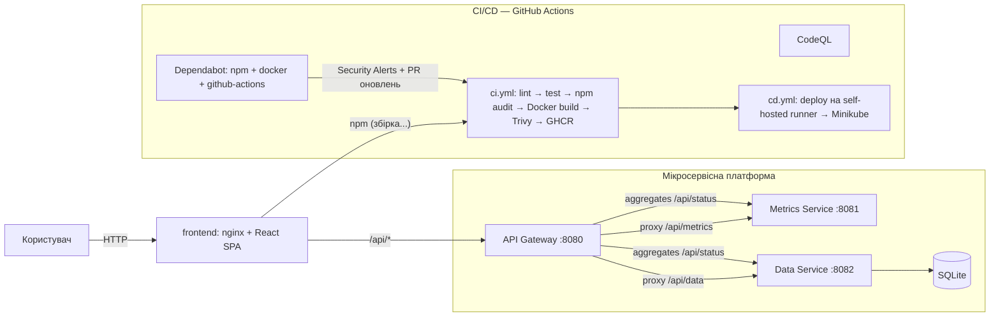

# 🛡️ DevSecOps Monitor — мікросервісна платформа

Курсова робота: **дослідження та реалізація архітектури стійкої клієнт-серверної взаємодії
та безпечної безперервної доставки (DevSecOps)** для масштабованої мікросервісної платформи
з інтерактивним веб-інтерфейсом.

Платформа складається з React-дашборда, трьох мікросервісів (Node.js + TypeScript),
Docker-конвеєра, локального Kubernetes-кластера (Minikube) та конвеєра CI/CD на
GitHub Actions із вбудованими перевірками безпеки (Dependabot, Trivy, npm audit, CodeQL).

---

## 🏗️ Архітектура



### Стійкість клієнт-серверної взаємодії (дослідницька частина)

| Патерн | Реалізація |
|---|---|
| API Gateway | Єдина точка входу, проксіювання `/api/metrics`, `/api/data`, агрегація `/api/status` |
| Health checks | `/health` у кожного сервісу + liveness/readiness проби в Kubernetes |
| Graceful degradation | Дашборд не падає при збої сервісу — показує статус `DOWN` |
| Retry з exponential backoff | `usePolling` у фронтенді: при помилці інтервал ×2 (до ×8) |
| Stateless сервіси | Можливість горизонтального масштабування (`replicas`) |
| Конфігурація поза кодом | Env / ConfigMap (`k8s/configmap.yaml`) |
| Graceful shutdown | Обробка `SIGTERM`/`SIGINT` у сервісах |

---

## 📁 Структура репозиторія

```
devsecops-platform/
├── frontend/                  # React + Vite + TypeScript + Recharts (дашборд)
├── services/
│   ├── gateway/               # API Gateway: проксі + агрегація статусу
│   ├── metrics/               # системні метрики (CPU/RAM/loadavg) та процеси
│   └── data/                  # CRUD дані (SQLite) + валідація zod
├── k8s/                       # Kubernetes-маніфести (namespace, deployments, ingress)
├── .github/
│   ├── dependabot.yml         # Dependabot: npm, docker, github-actions
│   └── workflows/
│       ├── ci.yml             # збірка, тести, npm audit, Docker+Trivy, GHCR
│       ├── cd.yml             # деплой на self-hosted runner (Minikube)
│       └── codeql.yml         # SAST-аналіз
├── scripts/                   # minikube-start.ps1, deploy.ps1, k8s-update-images.sh
├── docker-compose.yml         # локальний запуск усієї платформи
├── SETUP.md                   # інсталяція середовища (крок за кроком)
└── README.md
```

---

## 🚀 Швидкий старт

### 1. Локальна розробка (без Docker)

Потрібен Node.js ≥ 20. Запустіть у чотирьох терміналах:

```bash
cd services/metrics  && npm install && npm run dev   # :8081
cd services/data     && npm install && npm run dev   # :8082
cd services/gateway  && npm install && npm run dev   # :8080
cd frontend          && npm install && npm run dev   # :5173 (проксі /api → :8080)
```

Відкрийте <http://localhost:5173>.

> Для `services/*` у dev-режимі зовнішні URL за замовчуванням `http://metrics:8081`
> (Kubernetes-адреси). Локально задайте env `METRICS_URL`/`DATA_URL`:

```bash
# PowerShell (термінал gateway):
$env:METRICS_URL="http://localhost:8081"; $env:DATA_URL="http://localhost:8082"
```

> `docker-compose.yml` уже прописує коректні внутрішні адреси для Docker-мережі.

### 2. Docker Compose (уся платформа одним пакетом)

```bash
docker compose up --build
# Дашборд: http://localhost:3000   Gateway API: http://localhost:8080
```

### 3. Minikube (локальний кластер)

```powershell
.\scripts\minikube-start.ps1   # старт кластера + ingress
.\scripts\deploy.ps1           # збірка образів :local + kubectl apply
minikube service frontend -n devsecops   # відкрити дашборд
```

### 4. CI/CD (GitHub)

1. Створіть репозиторій на GitHub, наприклад `devsecops-platform`, і завантажте код:

   ```bash
   git init && git add . && git commit -m "init: devsecops platform"
   git branch -M main
   git remote add origin https://github.com/<USER>/devsecops-platform.git
   git push -u origin main
   ```

2. Далі автоматично почнуть працювати:
   - **CI** — збірка/тести/сканування на `push` і `pull_request`;
   - **CodeQL** — SAST-аналіз;
   - **Dependabot** — Security Alerts (вкладка *Security*) та PR оновлень залежностей.

3. Для деплою в локальний Minikube з GitHub зареєструйте **self-hosted runner**
   з міткою `minikube` (інструкція — у `SETUP.md`). Після цього `cd.yml` оновлюватиме
   образи та застосовуватиме маніфести автоматично.

---

## 🔒 DevSecOps: етапи безпеки

| Етап пайплайну | Інструмент | Що виявляє | Де |
|---|---|---|---|
| Планування залежностей | **Dependabot** | CVE у версіях бібліотек, автоматичні PR | GitHub Security |
| Залежності (локально/CI) | `npm audit --audit-level=high` | вразливості npm-залежностей | `ci.yml` |
| Статичний аналіз | **CodeQL** | SQL-ін'єкції, XSS, небезпечні потоки даних | `codeql.yml` |
| Docker-образи | **Trivy** | CVE у базових образах та шарах | `ci.yml` (fail on CRITICAL/HIGH) |
| Рантайм | non-root user, probes, resource limits | мінімізація поверхні атаки | Dockerfile / `k8s/*` |

### Контроль вразливостей (проактивний)

| Механізм | Дія |
|---|---|
| Dependabot Security Alerts | Сповіщення у вкладці **Security** про вразливі залежності |
| Dependabot Security Updates | Автоматичні PR-виправлення для критичних CVE |
| Dependabot Version Updates | Щотижневі PR оновлень для `npm`, `docker`, `github-actions` |
| Trivy у CI | Блокування мерджа образу з CRITICAL/HIGH CVE |
| `npm audit` у CI | Провал кроку при вразливостях високого рівня |

#### Приклад: SCA виявив і виправив реальну CVE (під час розробки)

`npm audit` на етапі встановлення залежностей фронтенду виявив **2 moderate-вразливості**:

- **CVE-2025-68470** (`GHSA-wrjc-x8rr-h8h6`) — React Router: open redirect через `\` у `<Link>`/`useNavigate`
- **GHSA-337j-9hxr-rhxg** — React Router: Arbitrary Constructor Injection у SSR hydration

**Дія:** залежність `react-router-dom` оновлено з `^6.28.1` до `^7.18.4` (виправлений реліз).
Повторний `npm audit` → **0 вразливостей**. Цикл «виявлення → оновлення → верифікація» —
саме той процес, який Dependabot автоматизує в CI/CD.

---

## 📡 API

| Метод | Шлях | Опис |
|---|---|---|
| GET | `/health` | Health-перевірка сервісу |
| GET | `/api/status` | **Gateway:** стан усіх сервісів + процеси |
| GET | `/api/metrics` | **Gateway→metrics:** системні метрики |
| GET | `/api/data/records` | **Gateway→data:** список записів (`?search=&status=&limit=&offset=`) |
| POST | `/api/data/records` | Створити запис |
| GET | `/api/data/records/:id` | Отримати запис |
| PUT | `/api/data/records/:id` | Оновити запис |
| DELETE | `/api/data/records/:id` | Видалити запис |

---

## ✅ Що зроблено / критерії виконання

- [x] Мікросервісна платформа (gateway + metrics + data), TypeScript
- [x] React-дашборд: моніторинг процесів/метрик + CRUD управління даними
- [x] Стійка клієнт-серверна взаємодія (health checks, backoff, graceful degradation)
- [x] Docker + docker-compose + багатоетапні збірки
- [x] Kubernetes-маніфести для Minikube (probes, limits, configmap, ingress)
- [x] GitHub Actions: CI (build/test/audit/Trivy/GHCR) + CD (self-hosted) + CodeQL
- [x] Dependabot для npm/docker/github-actions (Security Alerts + auto-updates)
- [ ] *Фізичний* запуск кластера Minikube — після налаштування віртуалізації (SETUP.md)