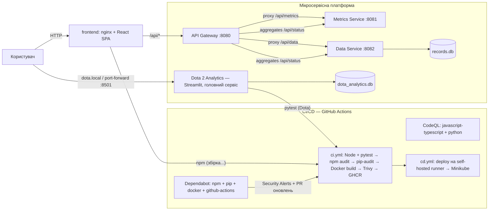

# 🛡️ DevSecOps платформа — аналітика та прогнозування матчів Dota 2

Курсова робота: **дослідження та реалізація архітектури стійкої клієнт-серверної взаємодії
та безпечної безперервної доставки (DevSecOps)** для масштабованої мікросервісної платформи.

**Головний сервіс платформи — інформаційна система аналітики Dota 2** (`app.py`, Streamlit) —
багатосторінковий застосунок (st.navigation / st.Page):

- 🎮 **«Аналітика Dota 2» — головна сторінка** (відкривається першою): аналіз зіграних матчів
  через OpenDota API, симулятор драфту (прогноз переможця за вінрейтами),
  персональний архів прогнозів (SQLite). Доступна після входу;
- 🛠 **«Платформа DevSecOps»** — публічні розділи (без логіну), див. нижче.

Сторінка **«Платформа DevSecOps»** (публічна, без логіну) об'єднує три таби:

- 📊 **Моніторинг платформи** — стан gateway/metrics/data через стійкий HTTP-клієнт
  (`dota/client.py`: таймаут, ретраї з бек-офом, кеш last-known-good, режим деградації);
- 🗄️ **Управління даними** — CRUD записів через data-сервіс + експорт/імпорт прогнозів;
- 🛡️ **Безпека / DevSecOps** — змодельований звіт проактивного контролю вразливостей
  (`dota/security.py`: Trivy-скани, Dependabot-алерти, запуски пайплайну — демо-генерація).

Навколо нього — повний DevSecOps-стек: React-дашборд, мікросервіси (Node.js + TypeScript),
Docker-конвеєр, Kubernetes (Minikube) і CI/CD на GitHub Actions із перевірками безпеки
(Dependabot, Trivy, npm audit, pip-audit, CodeQL).

---

## 🏗️ Архітектура



### Стійкість клієнт-серверної взаємодії (дослідницька частина)

| Патерн | Реалізація |
|---|---|
| API Gateway | Єдина точка входу, проксіювання `/api/metrics`, `/api/data`, агрегація `/api/status` |
| Health checks | `/health` у кожного сервісу + `/_stcore/health` у Dota + probes у Kubernetes |
| Graceful degradation | Дашборд не падає при збої сервісу — показує статус `DOWN` |
| Retry з exponential backoff | `usePolling` у фронтенді: при помилці інтервал ×2 (до ×8) |
| Стійкий HTTP-клієнт (Dota) | `dota/client.py`: таймаут, ретраї (GET + на 5xx), stale-кеш, режим «degraded» |
| Stateless сервіси | Можливість горизонтального масштабування (`replicas`) |
| Конфігурація поза кодом | Env / ConfigMap (`k8s/configmap.yaml`), `DOTA_DB_PATH`, `DOTA_API_URL` |
| Graceful shutdown | Обробка `SIGTERM`/`SIGINT` у сервісах |

---

## 📁 Структура репозиторія

```
devsecops-platform/
├── app.py                     # 🎯 ГОЛОВНИЙ СЕРВІС — багатосторінковий Streamlit:
│                              #    🎮 «Аналітика Dota 2» (головна, за логіном) +
│                              #    🛠 «Платформа DevSecOps» (публічні таби)
├── conftest.py                # корінь у sys.path для pytest (імпорт пакета dota)
├── dota/                      # Python-модулі головного сервісу
│   ├── db.py                  #   SQLite: users + prediction_history + імпорт/експорт
│   ├── predict.py             #   розрахунок ймовірності перемоги драфту
│   ├── client.py              #   стійкий HTTP-клієнт платформи (ретраї/кеш/деградація)
│   ├── security.py            #   змодельований звіт безпеки (демо-генератор)
│   ├── requirements.txt
│   └── Dockerfile             #   non-root, slim, python:3.12 + probes, без pip
├── tests/                     # pytest: dota.db, dota.predict, client, security, db-IO
├── frontend/                  # React + Vite + TypeScript + Recharts (дашборд)
├── services/
│   ├── gateway/               # API Gateway: проксі + агрегація статусу
│   ├── metrics/               # системні метрики (CPU/RAM/loadavg) та процеси
│   └── data/                  # CRUD дані (SQLite) + валідація zod
├── k8s/                       # Kubernetes-маніфести (namespace, deployments + dota, ingress)
├── .github/
│   ├── dependabot.yml         # Dependabot: npm, pip, docker, github-actions
│   └── workflows/
│       ├── ci.yml             # Node+Python тести, npm audit, pip-audit, Docker+Trivy, GHCR
│       ├── cd.yml             # деплой на self-hosted runner (Minikube)
│       └── codeql.yml         # SAST-аналіз (JS/TS + Python)
├── scripts/                   # minikube-start.ps1, deploy.ps1, k8s-update-images.sh
├── docker-compose.yml         # локальний запуск усієї платформи (5 сервісів)
├── SETUP.md                   # інсталяція середовища (крок за кроком)
└── README.md
```

---

## 🚀 Швидкий старт

### 1. Локальна розробка (без Docker)

**Головний сервіс (Python 3.12 + Streamlit):**

```bash
pip install -r dota/requirements.txt
streamlit run app.py            # http://localhost:8501
```

> Публічні таби «Моніторинг платформи» та «Управління даними» (сторінка
> «Платформа DevSecOps») звертаються до мікросервісів через `DOTA_API_URL`
> (за замовчуванням `http://gateway:8080` — Kubernetes-адреса). Локально вкажіть адресу port-forward:
>
> ```bash
> # PowerShell:
> $env:DOTA_API_URL="http://localhost:18080"     # gateway port-forward
> $env:DOTA_FRONTEND_URL="http://localhost:18083" # frontend port-forward
> streamlit run app.py
> ```
>
> Без вказання — таби покажуть статус «недоступно» з демонстрацією режиму деградації.

**Платформа (React + мікросервіси, Node.js ≥ 20)** — у чотирьох терміналах:

```bash
cd services/metrics  && npm install && npm run dev   # :8081
cd services/data     && npm install && npm run dev   # :8082
cd services/gateway  && npm install && npm run dev   # :8080
cd frontend          && npm install && npm run dev   # :5173 (проксі /api → :8080)
```

Відкрийте <http://localhost:5173>.

> Для `services/*` у dev-режимі зовнішні URL за замовчуванням `http://metrics:8081`
> (Kubernetes-адреси). Локально задайте env `METRICS_URL`/`DATA_URL`:

```bash
# PowerShell (термінал gateway):
$env:METRICS_URL="http://localhost:8081"; $env:DATA_URL="http://localhost:8082"
```

> `docker-compose.yml` уже прописує коректні внутрішні адреси для Docker-мережі.

### 2. Docker Compose (уся платформа одним пакетом)

```bash
docker compose up --build
# Дашборд: http://localhost:3000   Dota 2 Analytics: http://localhost:8501
# Gateway API: http://localhost:8080
```

### 3. Minikube (локальний кластер)

```powershell
.\scripts\minikube-start.ps1   # старт кластера + ingress
.\scripts\deploy.ps1           # збірка образів :local + kubectl apply
kubectl port-forward -n devsecops svc/dota 8501:8501        # Dota 2 Analytics (головний сервіс)
minikube service frontend -n devsecops                     # React-дашборд
```

### 4. CI/CD (GitHub)

1. Репозиторій на GitHub, гілка `main`, код уже завантажено — CI/CD працюють автоматично.

2. Далі автоматично працюють:
   - **CI** — Node-тести + pytest (Dota) + збірка/сканування на `push` і `pull_request`;
   - **CodeQL** — SAST-аналіз JS/TS та Python;
   - **Dependabot** — Security Alerts (вкладка *Security*) та PR оновлень залежностей
     (`npm`, `pip`, `docker`, `github-actions`).

3. Для деплою в локальний Minikube з GitHub зареєстрований **self-hosted runner**
   з міткою `minikube` (інструкція — у `SETUP.md`). Після цього `cd.yml` оновлює
   образи та застосовує маніфести автоматично.

---

## 🔒 DevSecOps: етапи безпеки

| Етап пайплайну | Інструмент | Що виявляє | Де |
|---|---|---|---|
| Планування залежностей | **Dependabot** | CVE у версіях бібліотек, автоматичні PR | GitHub Security |
| Залежності (Node, CI) | `npm audit --audit-level=high` | вразливості npm-залежностей | `ci.yml` |
| Залежності (Python, CI) | `pip-audit` | вразливості Python-залежностей (Dota) | `ci.yml` |
| Статичний аналіз | **CodeQL** | SQL-ін'єкції, XSS, небезпечні потоки даних | `codeql.yml` |
| Docker-образи | **Trivy** | CVE у базових образах та шарах | `ci.yml` (fail on CRITICAL/HIGH) |
| Рантайм | non-root user, probes, resource limits | мінімізація поверхні атаки | Dockerfile / `k8s/*` |

### Контроль вразливостей (проактивний)

| Механізм | Дія |
|---|---|
| Dependabot Security Alerts | Сповіщення у вкладці **Security** про вразливі залежності |
| Dependabot Security Updates | Автоматичні PR-виправлення для критичних CVE |
| Dependabot Version Updates | Щотижневі PR оновлень для `npm`, `pip`, `docker`, `github-actions` |
| Trivy у CI | Блокування мерджа образу з CRITICAL/HIGH CVE |
| `npm audit` / `pip-audit` у CI | Провал кроку при вразливостях високого рівня |

#### Приклад: SCA виявив і виправив реальну CVE (під час розробки)

`npm audit` на етапі встановлення залежностей фронтенду виявив **2 moderate-вразливості**:

- **CVE-2025-68470** (`GHSA-wrjc-x8rr-h8h6`) — React Router: open redirect через `\` у `<Link>`/`useNavigate`
- **GHSA-337j-9hxr-rhxg** — React Router: Arbitrary Constructor Injection у SSR hydration

**Дія:** залежність `react-router-dom` оновлено з `^6.28.1` до `^7.18.4` (виправлений реліз).
Повторний `npm audit` → **0 вразливостей**. Цикл «виявлення → оновлення → верифікація» —
саме той процес, який Dependabot автоматизує в CI/CD.

---

## 📡 API

| Метод | Шлях | Опис |
|---|---|---|
| GET | `/health` | Health-перевірка сервісу |
| GET | `/_stcore/health` | Health-перевірка Dota (Streamlit) |
| GET | `/api/status` | **Gateway:** стан усіх сервісів + процеси |
| GET | `/api/metrics` | **Gateway→metrics:** системні метрики |
| GET | `/api/data/records` | **Gateway→data:** список записів (`?search=&status=&limit=&offset=`) |
| POST | `/api/data/records` | Створити запис |
| GET | `/api/data/records/:id` | Отримати запис |
| PUT | `/api/data/records/:id` | Оновити запис |
| DELETE | `/api/data/records/:id` | Видалити запис |

Dota 2 Analytics (Streamlit) — власний UI: `http://localhost:8501` (або `dota.local` через ingress).

---

## 🎯 Карта вимог курсової роботи

| Вимога завдання | Де реалізовано та де демонструється |
|---|---|
| Архітектура стійкої клієнт-серверної взаємодії | Gateway як єдина точка входу (проксі + `/api/status`); стійкий HTTP-клієнт `dota/client.py` (таймаут, ретраї з бек-офом, stale-кеш, режим деградації); health checks + probes |
| Безпечна безперервна доставка (DevSecOps) | GitHub Actions: `ci.yml` (тести, npm/pip-audit, Docker, Trivy), `codeql.yml` (SAST), `cd.yml` (деплой на self-hosted runner → Minikube) |
| Масштабована мікросервісна платформа | `gateway` :8080, `metrics` :8081, `data` :8082, `frontend`, `dota` — 5 незалежних сервісів, stateless, ресурсні limits |
| Інтерактивний користувацький інтерфейс | Дві сторінки Streamlit (st.navigation): головна «Аналітика Dota 2» (аналіз матчів, симулятор драфту, архів — за логіном) + «Платформа DevSecOps» (публічні таби моніторингу/даних/безпеки) |
| Фронтенд-дашборд моніторингу системних процесів | React-дашборд (`frontend/`): сторінки Огляд / Метрики / Дані + публічний таб «Моніторинг платформи» у Dota |
| Управління даними | CRUD записів через data-сервіс (таб «Управління даними» + сторінка Дані у React); експорт/імпорт прогнозів (SQLite) |
| Автоматизований конвеєр збірки (React, Docker, Minikube, GitHub Actions) | CI збирає образи всіх 5 сервісів у GHCR; CD деплоїть у Minikube на self-hosted runner |
| Dependabot Security Vulnerability Alerts | `.github/dependabot.yml` (npm, pip, docker, github-actions): алерти + авто-PR; стан звітності — таб «Безпека / DevSecOps» у Dota |
| Виявлення вразливостей у залежностях | `npm audit` + `pip-audit` у CI (fail), Trivy-скан образів (поріг 0 CRITICAL/HIGH) |
| Автоматична генерація оновлень | Dependabot версійні PR; `cd.yml` підхоплює оновлені образи |
| Робоче локальне кластерне середовище з DevSecOps-пайплайном | Minikube + ingress (dashboard.local, dota.local), 5 деплойментів, CD оновлює кластер |
| Система проактивного контролю вразливостей | Таб «Безпека / DevSecOps» (демо-звіт) + реальні механізми: Dependabot Alerts, Trivy-gate у CI, CodeQL, аудити залежностей |

---

## ✅ Що зроблено / критерії виконання

- [x] 🎯 Головний сервіс: ІС аналітики Dota 2 (Streamlit + SQLite + OpenDota API), pytest-покриття (34 тести)
- [x] Дві сторінки Dota: головна «Аналітика Dota 2» (за логіном) + «Платформа DevSecOps» (публічні таби моніторингу/даних/безпеки)
- [x] Стійкий HTTP-клієнт Dota (`dota/client.py`): таймаут, ретраї, stale-кеш, деградація
- [x] Експорт/імпорт персональних прогнозів (CSV/JSON) + змодельований звіт безпеки
- [x] Мікросервісна платформа (gateway + metrics + data), TypeScript
- [x] React-дашборд: моніторинг процесів/метрик + CRUD управління даними
- [x] Стійка клієнт-серверна взаємодія (health checks, backoff, graceful degradation)
- [x] Docker + docker-compose (усі 5 сервісів, non-root) + багатоетапні збірки
- [x] Kubernetes-маніфести для Minikube (5 deployment'ів, probes, limits, configmap, ingress)
- [x] GitHub Actions: CI (Node+Python тести, npm audit, pip-audit, Trivy, GHCR) +
      CD (self-hosted) + CodeQL (JS/TS + Python)
- [x] Dependabot для npm/pip/docker/github-actions (Security Alerts + auto-updates)
- [x] Фізичний запуск кластера Minikube + деплой через CD